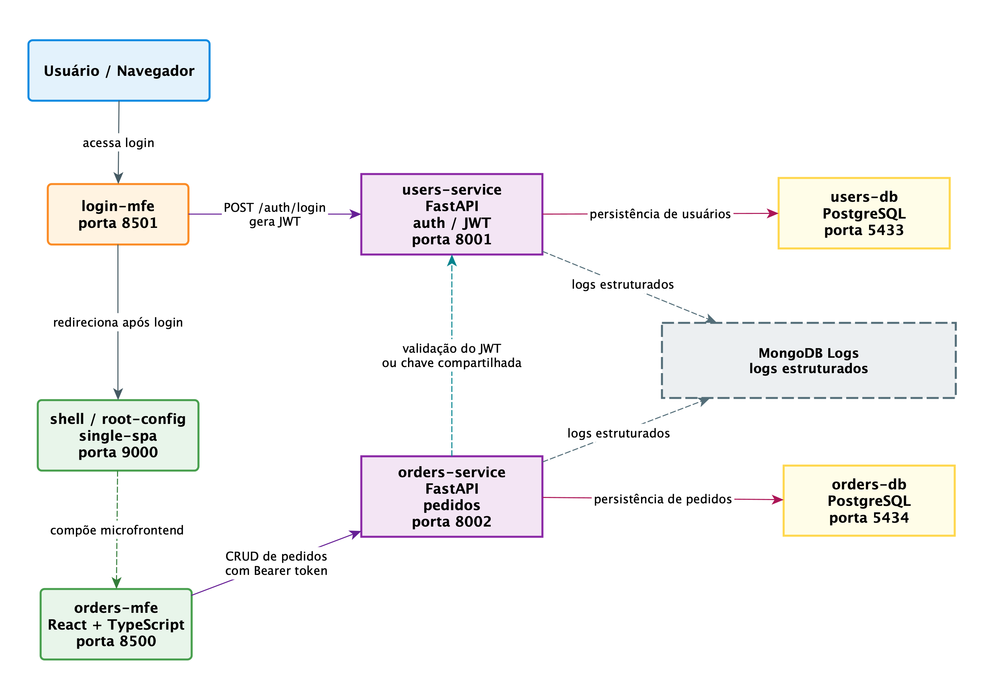

# Ecotech: Gestão de Pedidos de Moda Esportiva Sustentável


## 1. Contexto

A Ecotech é um e-commerce focado em moda esportiva sustentável. O processo atual de gestão de pedidos baseado em planilhas apresenta limitações como:

- ausência de atualização em tempo real;
- erros manuais frequentes;
- dificuldade de rastreamento de pedidos;
- baixa escalabilidade.

Este projeto propõe um **Produto Mínimo Viável (PMV)** utilizando uma arquitetura moderna com **microsserviços** e **microfrontends**.

---

## 2. Arquitetura


### Princípios adotados

- baixo acoplamento entre serviços;
- separação de responsabilidades;
- escalabilidade independente.

---

## 3. Backend

### 3.1 users-service
Responsável por autenticação e usuários:

- criação de usuários;
- login (JWT);
- validação de credenciais.

### 3.2 orders-service
Responsável por gestão dos pedidos:

- criação de pedidos;
- listagem;
- atualização de status; 
- filtro por status (`enumerável com status`), por ID do pedido (`order_id`) e por nome do cliente (`customer_name`);
- rota protegidas por JWT; 
- integração com backend orders-service.

### 3.3 Banco de Dados

Cada serviço possui seu próprio banco PostgreSQL:

- isolamento de dados;
- independência de deploy.

---

## 4. Frontend

Arquitetura baseada em **microfrontends com single-spa**.

### Shell
- orquestrador dos MFEs, realiza a gestão das rotas.

### orders-mfe
- criação, listagem, filtragem e atualização (status) de pedidos.

---

## 5. Autenticação (JWT)

### Fluxo

1. Login no `users-service`;
2. Geração de JWT com:
   - `sub` (email do usuário);
   - `exp` (expiração);
3. Envio do token ao cliente.

### Uso

```
Authorization: Bearer <token>
```

### Validação

- feita localmente em cada serviço;
- não há chamada entre serviços;
- depende de `SECRET_KEY` compartilhada.

### Benefícios

- stateless, escalável e desacoplado.

### 5.1 Autenticação no Frontend (Microfrontends)

Além da validação no backend, o frontend implementa **controle de acesso por token (JWT)** para impedir navegação direta às rotas dos microfrontends.

#### Estratégia adotada

- o token JWT é armazenado no `localStorage` após login;
- inicialmente, o orders-mfe verifica localmente se o usuário está autenticado;
- em caso negativo, ocorre redirecionamento para o `login-mfe`.

#### Proteções implementadas

- bloqueio de acesso direto ao `orders-mfe` (`:8500`);
- redirecionamento automático para login quando não autenticado;
- redirecionamento para o shell quando o usuário já está autenticado.

#### Responsabilidade por camada

- **Frontend (MFE):** controle de navegação e experiência do usuário;
- **Backend (services):** validação real de segurança via JWT (401 Unauthorized).

Essa abordagem segue o princípio de **defesa em profundidade**, combinando validação visual no frontend com proteção efetiva no backend.

---

## 6. Tecnologias

### Backend
- FastAPI
- SQLAlchemy
- PostgreSQL
- Pytest

### Frontend
- React
- TypeScript
- single-spa

### Infra
- Docker;
- MongoDB (logs estruturados).

---

## 7. Execução

```bash
docker compose up --build
```

### Endpoints

- Frontend: http://localhost:9000/orders;
- Users API: http://localhost:8001/docs;
- Orders API: http://localhost:8002/docs.

---

## 7.1 Configuração de Variáveis de Ambiente (.env)

O projeto utiliza um arquivo `.env` na raiz para configuração dos serviços.

### Banco de dados

```
USERS_DB_NAME=users_db
USERS_DB_USER=...
USERS_DB_PASSWORD=...

ORDERS_DB_NAME=orders_db
ORDERS_DB_USER=...
ORDERS_DB_PASSWORD=...
```

### Autenticação (JWT)

```
SECRET_KEY=ecotech-secret
ALGORITHM=HS256
ACCESS_TOKEN_EXPIRE_MINUTES=60
```

### Observações

- `SECRET_KEY` deve ser **idêntica em todos os serviços**
- `ALGORITHM` deve ser consistente (ex: HS256)
- `ACCESS_TOKEN_EXPIRE_MINUTES` define o tempo de expiração do token

Sem esse alinhamento, a validação do JWT entre microsserviços falhará (erro 401).

---

## 8. Testes
A implementação seguiu a estratégia no backend de Test Driven Development (TDD). Para executá-los: 

```bash
docker compose exec users-service pytest
docker compose exec orders-service pytest
```

### Cobertura atual
`orders-service`: 38 casos de teste.
- autenticação (login, token válido/inválido);
- rotas protegidas (401);
- criação de pedidos (201);
- listagem de pedidos (200);
- atualização de status;
- validação de payload (422);

`users service`: 16 casos de teste.
- validação de credenciais válidas e inválidas;
- criação de usuário, retorno correto de access_token, teste de rotas no caso de token inválido etc.

---

## 8.1 Integração Contínua (CI)

O projeto utiliza GitHub Actions para execução automática de testes a cada `push` ou `pull request` na branch principal.

### Pipeline

- execução de testes do `users-service`;
- execução de testes do `orders-service`;
- validação do ambiente via Docker;
- pipelines independentes para cada serviço (`users-service`, `orders-service`);
- pipelines independentes para cada microfrontend (`shell`, `orders-mfe`, `login-mfe`);
- execução automática de testes a cada `push` ou `pull request`,

### Benefícios

- garantia de integridade do código;
- detecção precoce de falhas;
- padronização do processo de build e teste.

---

## 9. Decisões Técnicas

### JWT compartilhado
- simplicidade para MVP;
- evita chamada entre serviços.

### Bancos separados
- isolamento;
- resiliência.

### FastAPI
- produtividade;
- tipagem forte.

### Microfrontends
- deploy independente;
- times independentes;
- possibilidade de adoção de diferentes frameworks.

---

## 9.1 Observabilidade (MongoDB)

O projeto implementa logs estruturados persistidos em MongoDB como camada complementar para o backend.

### Objetivo

- registrar eventos de negócio e técnicos;
- permitir rastreabilidade de requisições;
- facilitar debugging e observabilidade.


### Estrutura do log

Exemplo:

```json
{
  "timestamp": "2026-03-24T15:50:00Z",
  "level": "INFO",
  "service": "orders-service",
  "event": "orders_listed",
  "message": "orders_listed",
  "request_id": "uuid",
  "status_filter": "pending",
  "order_id_filter": 12,
  "customer_name_filter": "Maria",
  "result_count": 120
}
```

### Configuração de variáveis de ambiente

```
MONGO_URI=mongodb://logs-mongo:27017
MONGO_DB_NAME=ecotech_logs
```

### Debug opcional

Para inspecionar logs durante desenvolvimento:

```
DEBUG_MONGO_LOGGER=true
```

Isso imprime no console o documento antes da inserção.

### Benefícios

- separação entre dados transacionais e observabilidade;
- suporte a análise posterior (logs históricos);
- base para evolução com tracing e métricas.

---

## 10. Próximos Passos

- centralizar autenticação em um módulo compartilhado entre MFEs;
- implementar ProtectedRoute reutilizável;
- adicionar logout global no shell com contexto de usuário;
- persistir informações do usuário (ex: nome) no frontend;
- implementar refresh token e controle de expiração;
- integração completa do login no frontend;
- API Gateway / BFF (backend for frontend);
- observabilidade (tracing);
- uso de chave pública (RS256);
- testes no frontend.

---

## 11. Status do Projeto

### Entregas concluídas

- backend funcional com `users-service` e `orders-service`;
- autenticação JWT entre serviços, com rota protegida e validação local do token;
- testes automatizados no backend; 
- integração validada via Postman e frontend;
- ambiente dockerizado reproduzível com serviços isolados;
- persistência de logs estruturados no MongoDB para backend;
- pipeline de CI com GitHub Actions.

## 12. Conclusão

O projeto demonstra a implementação de uma arquitetura distribuída moderna com autenticação segura, testes automatizados e separação clara de responsabilidades, servindo como base sólida para evolução.